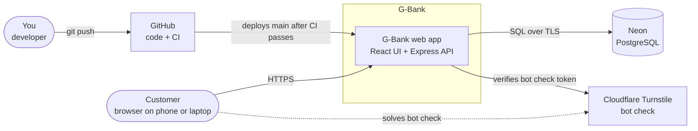
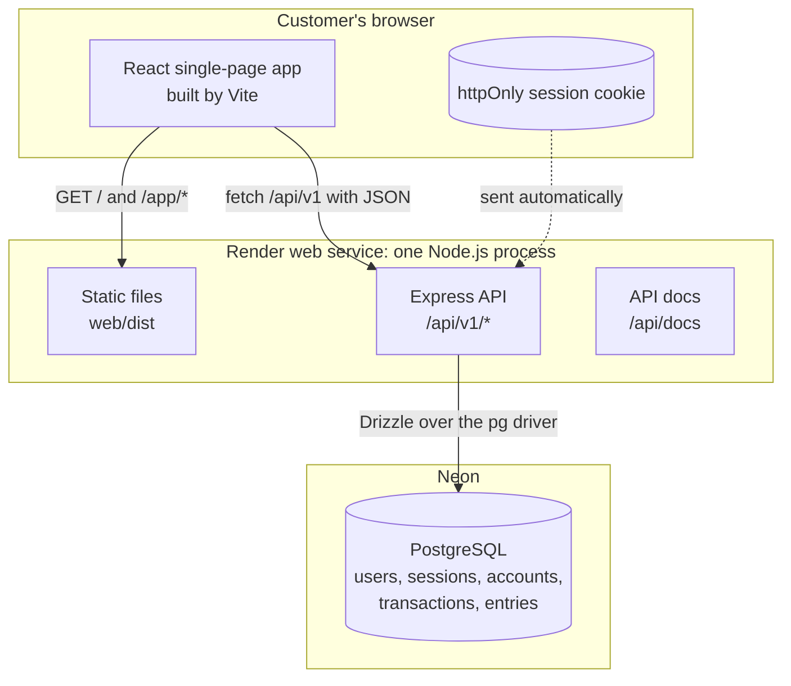
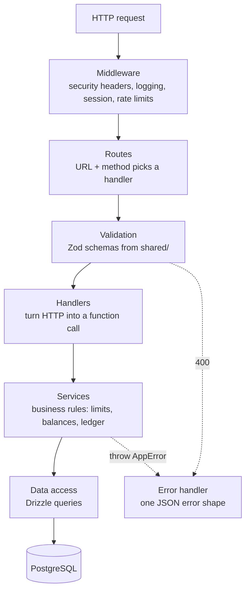
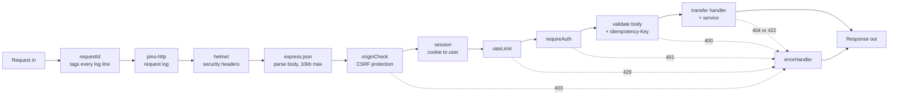
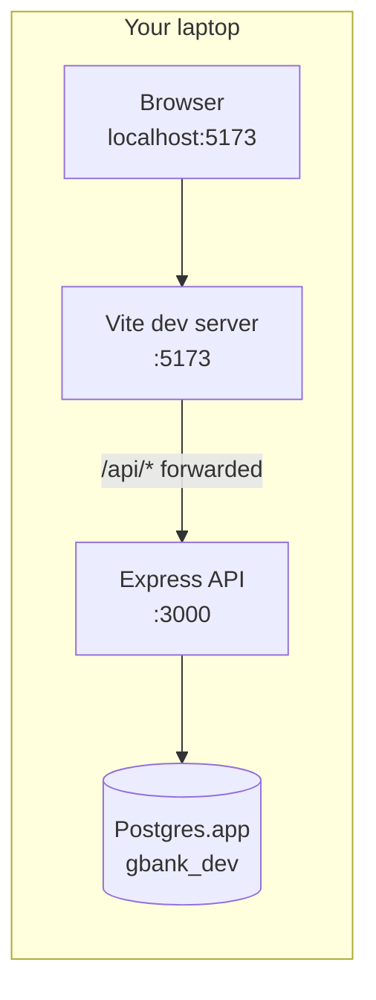

# 2. Architecture

## 2.1 System context

Who and what G-Bank talks to.



## 2.2 What runs where



**Why one service for both the UI and the API?** The browser sees a single origin (one domain), so the session cookie just works: no CORS setup, no cross-site cookie problems, and one thing to deploy. The React app is only static files after it's built, so Express can serve them next to the API.

## 2.3 Backend layers

Each layer has one job and only calls the layer below it.



| Layer | Job | Example for "send money" |
|---|---|---|
| Middleware | Things every request needs | Is there a valid session? Is this IP over its rate limit? |
| Route | Match URL + method to a handler | `POST /api/v1/transfers` goes to `createTransferHandler` |
| Validation | Reject bad input before any logic runs | `amountCents` must be a whole number from 1 to 1,000,000 |
| Handler | Translate HTTP into a plain function call and back | Reads `req.user.id` and the body, calls `createTransfer(...)`, sends `201` |
| Service | The business rules | Checks the daily limit, locks accounts, writes the ledger |
| Data access | Talk to the database | `SELECT ... FOR UPDATE`, `INSERT INTO entries ...` |
| Error handler | Turn any thrown error into the standard error JSON | `InsufficientFundsError` becomes `422 insufficient_funds` |

**Rule: services never see `req` or `res`.** A service is a normal function that takes plain data and returns plain data. That makes it easy to test without HTTP, and it keeps business rules out of the web plumbing.

## 2.4 Life of a request

What happens, in order, when the React app calls `POST /api/v1/transfers`.



## 2.5 Repository layout

```
bank-app/                   (rename to g-bank whenever you like)
├─ package.json             npm workspaces + root scripts
├─ tsconfig.base.json       shared TypeScript settings
├─ .env.example             every env var, with safe placeholder values
├─ .github/workflows/ci.yml
├─ docs/                    this plan
├─ shared/                  code used by both server and web
│  └─ src/
│     ├─ schemas/           Zod: auth, accounts, transfers, errors
│     ├─ money.ts           parseDollarsToCents, formatCents
│     └─ index.ts
├─ server/
│  ├─ drizzle.config.ts
│  ├─ src/
│  │  ├─ index.ts           starts the HTTP server
│  │  ├─ app.ts             builds the Express app (tests import this)
│  │  ├─ config.ts          reads and validates env vars
│  │  ├─ db/
│  │  │  ├─ client.ts       connection pool + Drizzle
│  │  │  ├─ schema.ts       table definitions
│  │  │  ├─ migrations/     generated SQL files, committed to git
│  │  │  ├─ seed.ts
│  │  │  └─ reconcile.ts    ledger health checks
│  │  ├─ middleware/        requestId, session, requireAuth, originCheck,
│  │  │                     rateLimit, validate, errorHandler
│  │  ├─ modules/           one folder per feature
│  │  │  ├─ auth/           routes.ts, service.ts, passwords.ts, sessions.ts
│  │  │  ├─ accounts/       routes.ts, service.ts
│  │  │  ├─ history/
│  │  │  ├─ recipients/
│  │  │  ├─ deposits/
│  │  │  └─ transfers/
│  │  ├─ lib/               errors.ts, clock.ts, accountNumber.ts, cursor.ts
│  │  └─ openapi.ts         builds the OpenAPI document from Zod schemas
│  └─ test/
└─ web/
   ├─ index.html
   ├─ vite.config.ts
   └─ src/
      ├─ main.tsx
      ├─ router.tsx
      ├─ api/               fetch client + TanStack Query hooks
      ├─ pages/
      ├─ components/        ui/ (shadcn) + G-Bank components
      └─ lib/
```

**Why folders per feature (`modules/transfers/`) instead of per layer (`routes/`, `services/`)?** When you work on transfers, everything about transfers is in one folder. Big codebases at real companies are usually organized this way for the same reason.

**About the files already in the repo:** there's a starter `package.json`, `tsconfig.json`, and `server/index.ts` from before we started planning. Milestone 0 reshapes them into this layout.

## 2.6 Environments

| | Local development | Tests | Production |
|---|---|---|---|
| Frontend | Vite dev server on `:5173` with hot reload | Not needed | Built files served by Express |
| API | Express on `:3000`, restarts on save | Runs inside the test process via Supertest | Render web service |
| Database | Postgres.app, database `gbank_dev` | Postgres.app `gbank_test` (a Postgres container in CI) | Neon |
| Cookie | `gbank_session`, not Secure (plain http on localhost) | Same as local | `__Host-gbank_session`, Secure |
| Turnstile | Cloudflare's test keys (always pass) | Turned off | Real keys |

In development the browser only talks to Vite, and Vite forwards `/api` requests to Express:



**Why forward (proxy) instead of calling `:3000` directly?** Then the browser sees one origin in development too, so cookies behave exactly like production. Otherwise you'd need CORS settings in dev that don't exist in prod, and bugs would hide in the difference.

## 2.7 Tech stack and versions

Latest versions checked on 2026-09-10. We pin exact versions when we install.

| Area | Package | Version | Job |
|---|---|---|---|
| Runtime | Node.js | 24.x | Runs the server, including `.ts` files directly |
| Language | TypeScript | 7.0 | Type checking (`tsc --noEmit`) |
| Server | express | 5.2 | HTTP framework |
| Server | zod | 4.6 | Validation + types (shared with web) |
| Server | @asteasolutions/zod-to-openapi | 9.1 | Builds the OpenAPI document from Zod schemas |
| Server | drizzle-orm / drizzle-kit | 0.45 / 0.31 | Queries / migrations |
| Server | pg | 8.23 | Postgres driver |
| Server | argon2 | 0.45 | Password hashing |
| Server | helmet | 8.3 | Security headers |
| Server | express-rate-limit | 8.7 | Rate limiting |
| Server | pino / pino-http | 10.3 / 11.0 | Structured JSON logs |
| Web | react / react-dom | 19.3 | UI |
| Web | vite | 8.3 | Dev server + production build |
| Web | react-router | 8.3 | Pages and URLs |
| Web | @tanstack/react-query | 5.102 | Fetching and caching server data |
| Web | tailwindcss | 4.3 | Styling |
| Web | shadcn/ui | CLI, copies code in | Accessible UI components (Button, Dialog...) |
| Web | @marsidev/react-turnstile | 1.6 | Turnstile widget |
| Tests | vitest | 5.0 | Test runner |
| Tests | supertest | 7.2 | Calls the API in tests |
| Quality | eslint / prettier | 10.10 / 3.9 | Linting / formatting |

Notes:
- **Running TypeScript without a build step.** Node 24 can run `.ts` files by removing the types ("type stripping"). The catch is you can only use TypeScript features that simply delete away, so no `enum` and no `namespace`. `tsconfig` has `erasableSyntaxOnly` turned on to enforce this. **Risk to confirm in M0:** importing `.ts` files from the `shared` workspace. Fallback if it doesn't work: run the server with `tsx`.
- **argon2:** Node 24 has an experimental built-in `crypto.argon2`. We use the `argon2` package because it's proven and stable; switching later is a small change.

## 2.8 Cross-cutting helpers

- **`lib/clock.ts`**: all code asks `clock.now()` for the time instead of calling `new Date()`. Tests can then "fast-forward" 16 minutes to test the idle timeout, or jump to tomorrow to test the daily limit reset.
- **`lib/errors.ts`**: one `AppError` class with `status`, `code`, and `message`. Services throw it, and the error handler turns it into JSON.
- **`config.ts`**: reads env vars once at startup and validates them with Zod. A missing `DATABASE_URL` stops the server immediately with a clear message, instead of crashing later on the first request.

## Check yourself

1. A request to `POST /api/v1/transfers` arrives with no session cookie. Which middleware stops it, and what status code does the browser get?
2. Why do services never receive `req` and `res`?
3. In development, what would break if the browser called `localhost:3000` directly instead of going through Vite's proxy?
