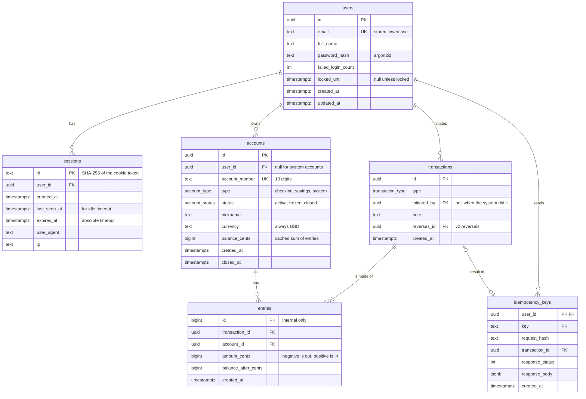
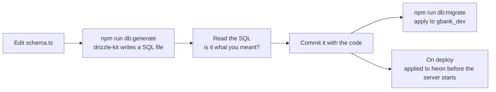

# 3. Database

## 3.1 The whole model in one picture



How to read the lines: `||--o{` means "one to zero-or-many". One user has zero or many sessions. `||--|{` means "one to one-or-many": a transaction always has at least one entry (in practice, two).

## 3.2 Why the ledger has this shape

Three tables work together:

- **accounts**: the buckets money sits in.
- **transactions**: the *events*. "Alice sent Bob $25 at 2:03pm with the note 'pizza'."
- **entries**: the *lines* of each event, one per account touched. Each entry says how much that account went up or down.

**Example: Alice sends Bob $25.00.** Alice had $30.00, Bob had $100.00.

`transactions`

| id | type | initiated_by | note |
|---|---|---|---|
| T1 | p2p_transfer | Alice | pizza |

`entries`

| id | transaction_id | account | amount_cents | balance_after_cents |
|---|---|---|---|---|
| 101 | T1 | Alice checking | -2500 | 500 |
| 102 | T1 | Bob checking | +2500 | 12500 |

The two amounts add up to **0**. That's **double-entry bookkeeping**: money is never created or destroyed, only moved. If the entries of any transaction don't add up to zero, something is broken, and that's easy to check.

**But deposits create money, right?** In G-Bank, deposits and the welcome bonus come from a special **system account** called the funding account. A $100 deposit to Alice looks like this:

| account | amount_cents |
|---|---|
| G-Bank funding (system) | -10000 |
| Alice checking | +10000 |

Still adds up to zero. The funding account's balance goes negative, and that negative number is exactly how much fake money G-Bank has handed out. System accounts are the only accounts allowed below zero.

**Why keep `balance_cents` on the account if the entries already hold the truth?**
1. **Speed.** Showing a balance reads one row instead of adding up thousands of entries.
2. **A database-level safety net.** A `CHECK` constraint on `balance_cents` means Postgres itself refuses to let a customer account go negative, even if our code has a bug.
3. **Something to lock.** Transfers lock the account row so two transfers can't spend the same money at once (see [Money movement](06-money-movement.md)).

The cached balance is updated **in the same database transaction** as the entries, so they succeed or fail together. We also run reconciliation checks (section 3.4) that prove the cache matches the entries.

## 3.3 Tables in detail

### Enums

| Enum | Values |
|---|---|
| `account_type` | `checking`, `savings`, `system` |
| `account_status` | `active`, `frozen`, `closed` |
| `transaction_type` | `welcome_bonus`, `deposit`, `internal_transfer`, `p2p_transfer`, `reversal` |

These are Postgres enums, defined in Drizzle with `pgEnum`. That's different from a TypeScript `enum`, which we can't use (see [Architecture](02-architecture.md#27-tech-stack-and-versions)).

### users

| Column | Type | Null? | Default | Notes |
|---|---|---|---|---|
| id | uuid | no | `gen_random_uuid()` | Primary key |
| email | text | no | | Unique. The app trims and lowercases it before saving |
| full_name | text | no | | `CHECK (char_length(full_name) BETWEEN 1 AND 100)` |
| password_hash | text | no | | argon2id string: algorithm, settings, salt, and hash in one |
| failed_login_count | integer | no | `0` | Reset to 0 on a successful login |
| locked_until | timestamptz | yes | | Set to now + 15 min after the 5th failure |
| created_at | timestamptz | no | `now()` | |
| updated_at | timestamptz | no | `now()` | App sets it on every update |

### sessions

| Column | Type | Null? | Default | Notes |
|---|---|---|---|---|
| id | text | no | | Primary key. SHA-256 (hex) of the cookie token. The raw token is **never** stored |
| user_id | uuid | no | | FK to `users`, `ON DELETE CASCADE` |
| created_at | timestamptz | no | | From `clock.now()` |
| last_seen_at | timestamptz | no | | Updated at most once a minute. Idle timeout = 15 min |
| expires_at | timestamptz | no | | `created_at + 12 hours`. Absolute timeout |
| user_agent | text | yes | | For the future "active sessions" list |
| ip | text | yes | | Same |

Index: `sessions (user_id)`, used when revoking all of a user's sessions.
Cleanup: expired sessions are deleted when someone tries to use them, plus an hourly cleanup query while the server runs.

### accounts

| Column | Type | Null? | Default | Notes |
|---|---|---|---|---|
| id | uuid | no | `gen_random_uuid()` | Primary key. Appears in URLs |
| user_id | uuid | yes | | FK to `users`, `ON DELETE RESTRICT` (never silently lose money records). Null only for system accounts |
| account_number | text | no | | Unique, `CHECK (account_number ~ '^[0-9]{10}$')`. Text, not a number, so leading zeros survive |
| type | account_type | no | | |
| status | account_status | no | `'active'` | |
| nickname | text | yes | | `CHECK (char_length(nickname) <= 30)` |
| currency | text | no | `'USD'` | `CHECK (currency = 'USD')` |
| balance_cents | bigint | no | `0` | Cached balance, see 3.2 |
| created_at | timestamptz | no | `now()` | |
| closed_at | timestamptz | yes | | |

Table-level constraints:
- `CHECK ((type = 'system') = (user_id IS NULL))`: system accounts have no owner, and customer accounts must have one.
- `CHECK (type = 'system' OR balance_cents >= 0)`: **BR3 enforced by the database itself.**

Index: `accounts (user_id)`.

### transactions

| Column | Type | Null? | Default | Notes |
|---|---|---|---|---|
| id | uuid | no | `gen_random_uuid()` | Primary key |
| type | transaction_type | no | | |
| initiated_by | uuid | yes | | FK to `users`. Null for system actions like the welcome bonus |
| note | text | yes | | `CHECK (char_length(note) <= 140)` |
| reverses_id | uuid | yes | | FK to `transactions`. Used by v2 reversals |
| created_at | timestamptz | no | | From `clock.now()` |

Index: `transactions (initiated_by, type, created_at)`, for the daily limit query.

### entries

| Column | Type | Null? | Default | Notes |
|---|---|---|---|---|
| id | bigint | no | generated identity | Primary key. Internal only, never used on its own in a URL |
| transaction_id | uuid | no | | FK to `transactions` |
| account_id | uuid | no | | FK to `accounts` |
| amount_cents | bigint | no | | `CHECK (amount_cents <> 0)`. Negative leaves the account, positive enters it |
| balance_after_cents | bigint | no | | The account's balance right after this entry, for history screens |
| created_at | timestamptz | no | | From `clock.now()`, same value as its transaction |

Indexes:
- `entries (account_id, created_at DESC, id DESC)`: makes history pages fast.
- `entries (transaction_id)`

**Why is `entries.id` a counting number when everything else is a UUID?** UUIDs protect things people can see and type into URLs. Entries are always reached *through* an account the user owns, so there's nothing to guess. Counting numbers are also smaller and faster to index. Choosing per table like this is normal.

### idempotency_keys

| Column | Type | Null? | Default | Notes |
|---|---|---|---|---|
| user_id | uuid | no | | Part of the primary key. FK to `users` |
| key | text | no | | Part of the primary key. The `Idempotency-Key` header value, max 255 characters |
| request_hash | text | no | | SHA-256 of method + path + body, to spot the same key reused for a different request |
| transaction_id | uuid | yes | | FK to `transactions` |
| response_status | integer | yes | | Saved so a retry gets the exact same answer |
| response_body | jsonb | yes | | Same |
| created_at | timestamptz | no | | Rows older than 24 hours are deleted by the hourly cleanup |

## 3.4 Guardrails inside the database

Our code should never break the rules, but "should" isn't good enough for money. These guardrails catch bugs the code misses.

1. **No negative customer balances:** the `CHECK` constraint on `accounts`.
2. **Foreign keys:** an entry can't point at an account or transaction that doesn't exist.
3. **Unique constraints:** emails, account numbers, idempotency keys.
4. **Append-only ledger:** a trigger refuses any `UPDATE` or `DELETE` on `transactions` and `entries`.

```sql
CREATE FUNCTION forbid_ledger_changes() RETURNS trigger AS $$
BEGIN
  RAISE EXCEPTION 'ledger rows are append-only (% on %)', TG_OP, TG_TABLE_NAME;
END;
$$ LANGUAGE plpgsql;

CREATE TRIGGER entries_append_only
  BEFORE UPDATE OR DELETE ON entries
  FOR EACH ROW EXECUTE FUNCTION forbid_ledger_changes();

CREATE TRIGGER transactions_append_only
  BEFORE UPDATE OR DELETE ON transactions
  FOR EACH ROW EXECUTE FUNCTION forbid_ledger_changes();
```

`TRUNCATE` doesn't fire row triggers, so tests can still wipe the test database between runs.

5. **Reconciliation checks**, run after every test and on demand with `npm run db:reconcile`. Each one must return zero rows (or zero):

```sql
-- 1. Every transaction adds up to zero
SELECT transaction_id, SUM(amount_cents) AS total
FROM entries
GROUP BY transaction_id
HAVING SUM(amount_cents) <> 0;

-- 2. Every cached balance matches its entries
SELECT a.id, a.balance_cents, COALESCE(SUM(e.amount_cents), 0) AS from_entries
FROM accounts a
LEFT JOIN entries e ON e.account_id = a.id
GROUP BY a.id
HAVING a.balance_cents <> COALESCE(SUM(e.amount_cents), 0);

-- 3. All money in the system adds up to zero (expect 0)
SELECT COALESCE(SUM(balance_cents), 0) FROM accounts;
```

Stretch goal: a deferred constraint trigger that checks rule 1 at `COMMIT` time, so a broken transaction can't be saved at all.

## 3.5 Money in the database

- Every amount is a `bigint` number of cents. In Drizzle: `bigint({ mode: "number" })`, which gives a normal JavaScript number. JavaScript numbers are exact up to 2^53, about $90 trillion, so we're fine.
- **Never** `real`, `double precision`, or JavaScript float math on money. Try `0.1 + 0.2` in a browser console to see why.

## 3.6 Account numbers

- 10 random digits from `crypto.randomInt`. If the number is already taken (the unique constraint fails), try again, up to 5 times.
- Random, not sequential, so knowing your own number tells you nothing about anyone else's.
- The funding account is seeded with the fixed number `0000000001`.

## 3.7 The queries the app runs most

**One page of an account's history** (keyset pagination, explained in the [API doc](04-api.md#44-pagination)):

```sql
SELECT e.amount_cents, e.balance_after_cents, e.created_at, e.id AS entry_id,
       t.id AS transaction_id, t.type, t.note
FROM entries e
JOIN transactions t ON t.id = e.transaction_id
WHERE e.account_id = $1
  AND (e.created_at, e.id) < ($2, $3)   -- from the cursor; left out on the first page
ORDER BY e.created_at DESC, e.id DESC
LIMIT 21;                                -- ask for 1 extra to know if there's a next page
```

**How much has this user sent to other people today?**

```sql
SELECT COALESCE(SUM(-e.amount_cents), 0) AS sent_today_cents
FROM transactions t
JOIN entries e ON e.transaction_id = t.id AND e.amount_cents < 0
WHERE t.initiated_by = $1
  AND t.type = 'p2p_transfer'
  AND t.created_at >= $2;   -- start of today in UTC, from clock.now()
```

The app passes the start of the day in, instead of letting Postgres use its own `now()`, so tests can control time.

## 3.8 Migrations

A **migration** is a SQL file that changes the database structure one step at a time. Together, the files are a versioned history of the schema, just like git history for code.



Rules:
- **Never edit a migration that has already run anywhere.** Fix mistakes with a new migration.
- Hand-written SQL (like the trigger above) goes in a custom migration: `drizzle-kit generate --custom`.
- Migrations run automatically on every deploy, before the new server version starts.

## 3.9 Seed data

- **Every environment:** the G-Bank funding account (`system`, number `0000000001`).
- **Development only:** two users, `alice@example.com` and `bob@example.com`, with a few deposits and transfers. The seed script creates them **through the real service functions**, so the seed data follows every ledger rule too.

## 3.10 Local databases

Two databases on your laptop, both in Postgres.app:
- `gbank_dev`: what you click around in. Keep it or reset it whenever you like.
- `gbank_test`: wiped before every test. Never put anything you care about in it.

## Check yourself

1. Why does the funding account's balance go negative, and why is that fine?
2. Say a bug updates `balance_cents` but forgets to insert the entries. Which guardrail catches it, and when?
3. Why is `entries.id` a counting number but `accounts.id` a UUID?
