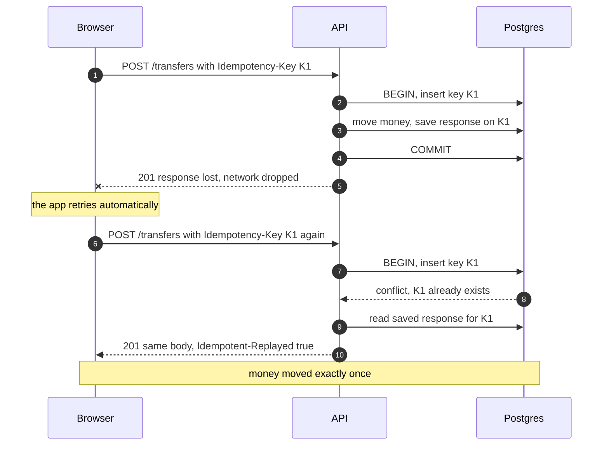

# 4. API contract (v1)

**Source of truth:** the Zod schemas in `shared/src/schemas/`. The server generates an OpenAPI 3.1 document from them and serves interactive docs at `/api/docs`. This page is the human-readable version. If this page and the schemas ever disagree, fix whichever is wrong in the same pull request.

## 4.1 Conventions

| Topic | Rule |
|---|---|
| Base URL | `/api/v1` |
| Format | JSON in and out. Requests with a body must send `Content-Type: application/json`, otherwise `415` |
| Field names | camelCase (`amountCents`, `createdAt`) |
| URLs | Plural nouns (`/accounts`, `/transfers`) |
| Money | Integer cents, in fields ending with `Cents`. Never floats, never strings like `"$12.34"` |
| Time | ISO 8601 in UTC: `"2026-09-10T14:03:00.000Z"` |
| IDs | UUID strings |
| Account numbers | 10-digit strings (strings, so leading zeros survive) |
| Auth | The session cookie set at signup or login. The browser sends it automatically. No `Authorization` header |
| Request ID | Every response has an `X-Request-Id` header. Errors also include it in the body, so a bug report can point at the exact log lines |
| Unknown fields | Rejected with `400`. A typo like `ammountCents` fails loudly instead of being ignored |

## 4.2 Errors

Every error, from every endpoint, has this shape:

```json
{
  "error": {
    "code": "insufficient_funds",
    "message": "This account doesn't have enough money for this transfer.",
    "requestId": "3f2a9c1e-7b6d-4e5f-a0b1-c2d3e4f5a6b7",
    "details": [],
    "meta": {}
  }
}
```

- `code`: stable and machine-readable. The frontend switches on this, never on `message`.
- `message`: human-readable, safe to show the user.
- `details`: only for `validation_error`. One item per bad field: `{ "path": "amountCents", "message": "Must be a whole number of cents" }`.
- `meta`: extra data for specific errors. For `daily_limit_exceeded` it holds `{ "remainingTodayCents": 150000 }`.

### Error catalog

| HTTP | code | When |
|---|---|---|
| 400 | `validation_error` | Body, query, or URL params don't match the schema |
| 400 | `missing_idempotency_key` | `POST /deposits` or `POST /transfers` without the header |
| 400 | `invalid_cursor` | The pagination cursor was tampered with or is malformed |
| 400 | `bot_check_failed` | Turnstile token missing or rejected (production only) |
| 401 | `unauthenticated` | No valid session |
| 401 | `session_expired` | Session idle for over 15 minutes, or older than 12 hours |
| 401 | `invalid_credentials` | Login with a wrong email **or** wrong password (same code for both on purpose) |
| 403 | `csrf_failed` | `Origin` header missing or not G-Bank's on a request that changes data |
| 404 | `not_found` | The resource doesn't exist **or belongs to someone else** |
| 404 | `recipient_not_found` | No active account has that account number |
| 409 | `email_taken` | Signup with an email that's already registered |
| 409 | `idempotency_key_reused` | Same idempotency key sent with a different request body |
| 415 | `unsupported_media_type` | Body isn't JSON |
| 422 | `insufficient_funds` | Balance lower than the amount |
| 422 | `daily_limit_exceeded` | Sending to other customers would go over $5,000.00 today |
| 422 | `same_account` | From and to are the same account |
| 422 | `account_not_active` | From or to account is frozen or closed |
| 422 | `account_limit_reached` | Already has 5 open accounts |
| 422 | `current_password_incorrect` | Change-password with the wrong current password |
| 429 | `too_many_attempts` | Rate limit hit, or the account is locked after failed logins. Includes a `Retry-After` header |
| 500 | `internal_error` | A bug. The message is generic; the details are only in the server logs |

**Why `404` and not `403` for someone else's account?** `403 Forbidden` would confirm the account exists. `404` gives an attacker nothing to learn.

**Why `422` for broken business rules?** `400` means "your request is malformed." A transfer of `2500` cents is perfectly well-formed; it just breaks a rule given the current balance. `422 Unprocessable Content` says exactly that.

## 4.3 Idempotency

Moving money must be safe to retry. Networks drop responses, and people double-click.

- `POST /deposits` and `POST /transfers` **require** an `Idempotency-Key` header. It's a UUID the client creates once per user intent (see [Frontend](07-frontend.md#74-the-transfer-flow)).
- The server remembers each key for 24 hours, per user.

| Situation | What the server does |
|---|---|
| New key | Processes the request, saves the response with the key |
| Same key, same body, first request succeeded | Returns the saved response again with header `Idempotent-Replayed: true`. No money moves |
| Same key, different body | `409 idempotency_key_reused` |
| Same key while the first request is still running | Waits for the first to finish, then returns its saved response |
| First request failed (any 4xx or 5xx) | Nothing was saved, so a retry with the same key runs normally |



## 4.4 Pagination

History lists use **cursor pagination** (also called keyset pagination).

- Query params: `limit` (1 to 50, default 20) and `cursor` (the `nextCursor` value from the previous page).
- Response: `{ "data": [...], "nextCursor": "eyJ0IjoiMjAyNi0w..." }`. `nextCursor` is `null` on the last page.
- The cursor is an opaque string. The client never builds or reads it, just passes it back.

**Why not page numbers (`?page=3`)?** Page numbers count rows from the top. If a new transaction arrives while you scroll, every row shifts down by one and you see a duplicate. A cursor means "the next 20 older than this exact row," which stays correct.

## 4.5 Rate limits

| Endpoint | Limit | Counted per |
|---|---|---|
| `POST /auth/login` | 20 per 15 minutes | IP address |
| `POST /auth/login` | Account locks for 15 minutes after 5 failures in a row | Account |
| `POST /auth/signup` | 5 per hour | IP address |
| `POST /recipients/lookup` | 30 per hour | User |
| Everything else | 300 per 15 minutes | IP address |

Responses include the standard `RateLimit-*` headers. A `429` includes `Retry-After` (seconds).

## 4.6 Shared objects

**User**
```json
{
  "id": "7d9f2c1a-4b3e-4f6a-9c8d-2e1f0a3b5c7d",
  "fullName": "Alice Moreno",
  "email": "alice@example.com",
  "createdAt": "2026-09-10T14:00:00.000Z"
}
```

**Account**
```json
{
  "id": "0f8e6b2a-3c4d-4e5f-8a9b-1c2d3e4f5a6b",
  "accountNumber": "4829301746",
  "type": "checking",
  "nickname": "Everyday",
  "status": "active",
  "currency": "USD",
  "balanceCents": 97500,
  "createdAt": "2026-09-10T14:00:00.000Z"
}
```

**HistoryItem**: one line of history, from the point of view of one of *your* accounts.
```json
{
  "transactionId": "c4e5f6a7-b8c9-4d0e-9f1a-2b3c4d5e6f70",
  "accountId": "0f8e6b2a-3c4d-4e5f-8a9b-1c2d3e4f5a6b",
  "type": "p2p_transfer",
  "amountCents": -2500,
  "balanceAfterCents": 97500,
  "description": "To Bob S. ••••7731",
  "note": "pizza",
  "createdAt": "2026-09-10T14:03:00.000Z"
}
```
- `amountCents` is signed: negative left this account, positive came in.
- The server writes `description` ("Welcome bonus", "Deposit", "Transfer to Savings ••••2290", "From Alice M. ••••1746") so every screen describes transactions the same way.
- A transfer between two of your own accounts appears as two items (one per account). The frontend uses `transactionId` + `accountId` as the unique key.

**Transaction**: returned after a deposit or transfer.
```json
{
  "id": "c4e5f6a7-b8c9-4d0e-9f1a-2b3c4d5e6f70",
  "type": "p2p_transfer",
  "amountCents": 2500,
  "from": { "accountId": "0f8e6b2a-3c4d-4e5f-8a9b-1c2d3e4f5a6b", "accountNumberLast4": "1746", "displayName": "Everyday" },
  "to": { "accountId": null, "accountNumberLast4": "7731", "displayName": "Bob S." },
  "note": "pizza",
  "createdAt": "2026-09-10T14:03:00.000Z"
}
```
- `amountCents` is always positive here: it's the size of the transfer.
- `accountId` is only filled in for accounts you own. You never learn someone else's internal ID.
- For deposits, `from` is `null`.

**Limits**
```json
{
  "dailyLimitCents": 500000,
  "usedTodayCents": 2500,
  "remainingTodayCents": 497500,
  "resetsAt": "2026-09-11T00:00:00.000Z"
}
```

## 4.7 Endpoints

| Method | Path | Login? | What it does | Success |
|---|---|---|---|---|
| GET | `/health` | no | Is the server process up? | 200 |
| GET | `/health/ready` | no | Can the server reach the database? | 200 or 503 |
| POST | `/auth/signup` | no | Create user + checking account + welcome bonus, then log in | 201 |
| POST | `/auth/login` | no | Log in | 200 |
| POST | `/auth/logout` | yes | End this session | 204 |
| GET | `/me` | yes | Who am I? | 200 |
| POST | `/me/password` | yes | Change password | 204 |
| POST | `/me/sessions/revoke-others` | yes | Sign out all other devices | 204 |
| GET | `/me/limits` | yes | Daily sending limit status | 200 |
| GET | `/accounts` | yes | My accounts | 200 |
| POST | `/accounts` | yes | Open an account | 201 |
| GET | `/accounts/{accountId}` | yes | One of my accounts | 200 |
| PATCH | `/accounts/{accountId}` | yes | Rename (nickname) | 200 |
| GET | `/accounts/{accountId}/history` | yes | History for one account | 200 |
| GET | `/history` | yes | History across all my accounts (dashboard) | 200 |
| POST | `/recipients/lookup` | yes | Find a recipient by account number | 200 |
| POST | `/deposits` | yes | Simulated deposit | 201 |
| POST | `/transfers` | yes | Move money | 201 |

Every endpoint that needs login can also return `401 unauthenticated` or `401 session_expired`, and every request that changes data can return `403 csrf_failed` and `429 too_many_attempts`. The lists below leave those out.

### GET /health
`200 { "status": "ok" }`

### GET /health/ready
Runs `SELECT 1` against the database. `200 { "status": "ok" }` or `503 { "status": "unavailable" }`.

### POST /auth/signup
Request:
```json
{
  "fullName": "Alice Moreno",
  "email": "alice@example.com",
  "password": "correct-horse-battery",
  "turnstileToken": "0.xxxx"
}
```
`turnstileToken` is required in production only.

`201 { "user": User }`, plus a `Set-Cookie` header that logs the user in.

Errors: `400 validation_error`, `400 bot_check_failed`, `409 email_taken`.

### POST /auth/login
Request: `{ "email": "alice@example.com", "password": "correct-horse-battery", "turnstileToken": "0.xxxx" }`

`200 { "user": User }`, plus:
```
Set-Cookie: __Host-gbank_session=<random token>; Path=/; HttpOnly; Secure; SameSite=Lax; Max-Age=43200
```

Errors: `400 validation_error`, `400 bot_check_failed`, `401 invalid_credentials`, `429 too_many_attempts`.

### POST /auth/logout
No body. `204`, with a `Set-Cookie` that clears the cookie. Returns `204` even if the session was already gone, so logging out twice is harmless.

### GET /me
`200 { "user": User }`

### POST /me/password
Request: `{ "currentPassword": "...", "newPassword": "..." }`

`204`. Every other session for this user is deleted, and the current session is replaced with a new one (new cookie).

Errors: `400 validation_error`, `422 current_password_incorrect`.

### POST /me/sessions/revoke-others
No body. `204`. Deletes every session for this user except the current one.

### GET /me/limits
`200 Limits`

### GET /accounts
`200 { "data": [Account, ...] }`. Accounts with status `active` or `frozen`, oldest first. Closed accounts are left out.

### POST /accounts
Request: `{ "type": "savings", "nickname": "Rainy day" }` (`nickname` is optional)

`201 { "account": Account }`

Errors: `400 validation_error`, `422 account_limit_reached`.

### GET /accounts/{accountId}
`200 { "account": Account }`

Errors: `404 not_found`.

### PATCH /accounts/{accountId}
Request: `{ "nickname": "Bills" }`, or `{ "nickname": null }` to remove it.

`200 { "account": Account }`

Errors: `400 validation_error`, `404 not_found`.

### GET /accounts/{accountId}/history?limit=20&cursor=...
`200 { "data": [HistoryItem, ...], "nextCursor": "..." }`

Errors: `400 validation_error`, `400 invalid_cursor`, `404 not_found`.

### GET /history?limit=5&cursor=...
Same as above, but across all of your accounts.

### POST /recipients/lookup
Request: `{ "accountNumber": "7702847731" }`

`200`:
```json
{ "accountNumberLast4": "7731", "displayName": "Bob S.", "isOwnAccount": false }
```

Errors: `400 validation_error`, `404 recipient_not_found`, `429 too_many_attempts`.

**Why POST for a lookup?** With GET, the account number would sit in the URL, and URLs end up in server logs, browser history, and analytics. POST keeps it in the body.

### POST /deposits
Headers: `Idempotency-Key: 9b1d0c3e-2f4a-4b5c-8d6e-7f8a9b0c1d2e`

Request: `{ "accountId": "0f8e6b2a-3c4d-4e5f-8a9b-1c2d3e4f5a6b", "amountCents": 30000 }`

`201 { "transaction": Transaction }`

Errors: `400 validation_error`, `400 missing_idempotency_key`, `404 not_found`, `409 idempotency_key_reused`, `422 account_not_active`.

### POST /transfers
Headers: `Idempotency-Key: 5e6f7a8b-9c0d-4e1f-a2b3-c4d5e6f7a8b9`

Request:
```json
{
  "fromAccountId": "0f8e6b2a-3c4d-4e5f-8a9b-1c2d3e4f5a6b",
  "toAccountNumber": "7702847731",
  "amountCents": 2500,
  "note": "pizza"
}
```

The server decides whether it's an `internal_transfer` (both accounts are yours) or a `p2p_transfer` (someone else's), based on who owns the destination account.

`201 { "transaction": Transaction }`

Errors: `400 validation_error`, `400 missing_idempotency_key`, `404 not_found` (from-account isn't yours), `404 recipient_not_found`, `409 idempotency_key_reused`, `422 same_account`, `422 insufficient_funds`, `422 daily_limit_exceeded` (with `meta.remainingTodayCents`), `422 account_not_active`.

## 4.8 What the contract looks like in code

A preview of `shared/src/schemas/transfers.ts`. One schema becomes the runtime check, the TypeScript type, and the OpenAPI docs.

```ts
import { z } from "zod";

export const CreateTransferRequest = z.strictObject({
  fromAccountId: z.uuid(),
  toAccountNumber: z.string().regex(/^\d{10}$/, "Must be 10 digits"),
  amountCents: z.int().min(1).max(1_000_000),
  note: z.string().trim().max(140).optional(),
});

export type CreateTransferRequest = z.infer<typeof CreateTransferRequest>;
```

`strictObject` is what makes unknown fields fail with `400`.

## Check yourself

1. Alice has $20.00 and tries to send $25.00. Which status code and error code does she get, and why not `400`?
2. Why does `GET /accounts/{accountId}` return `404` instead of `403` when the account belongs to someone else?
3. A user double-clicks "Confirm". Walk through what the server does with the second request.
