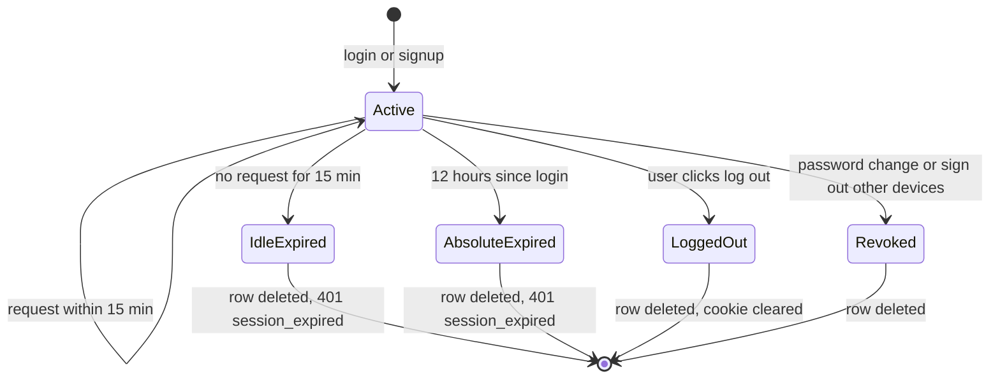
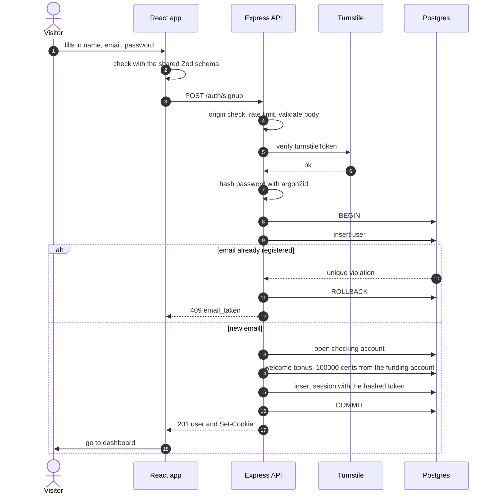
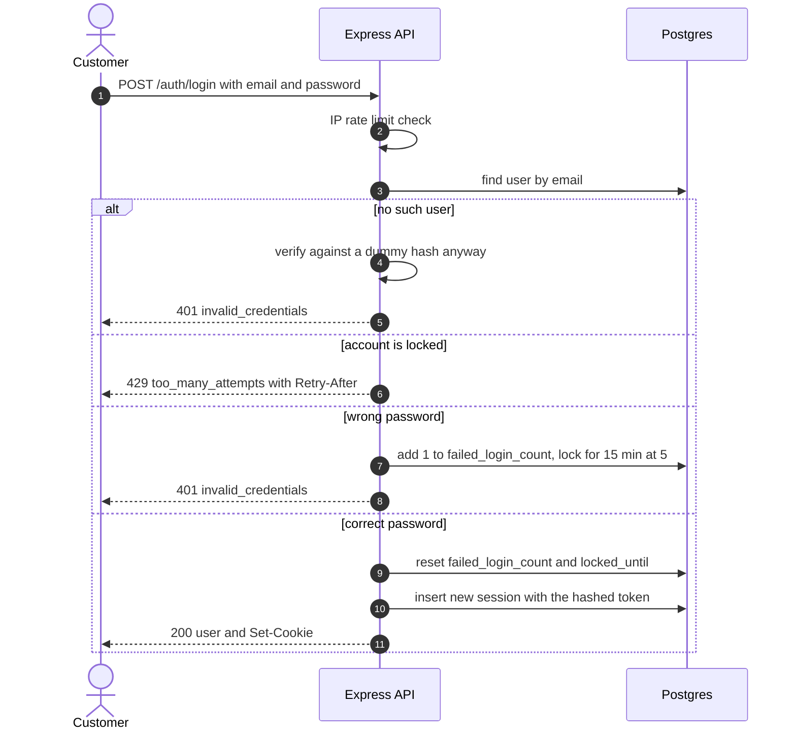
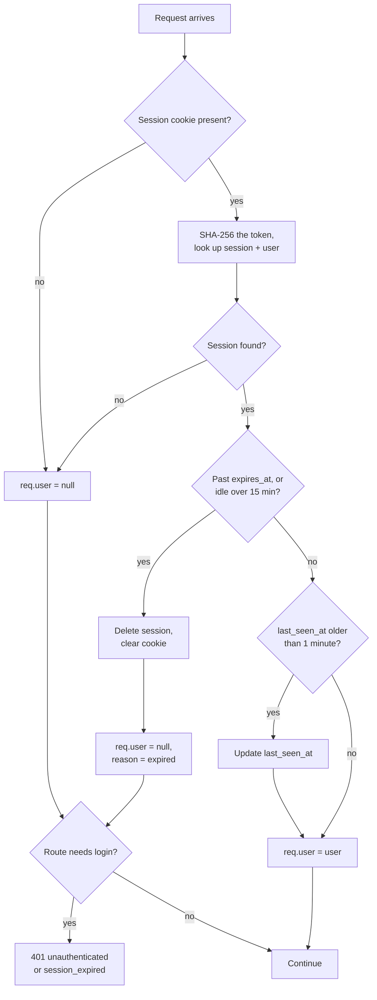

# 5. Auth and security

## 5.1 Words first

- **Authentication**: *who are you?* Proving you're Alice (logging in).
- **Authorization**: *what are you allowed to do?* Alice can use Alice's accounts, not Bob's.
- **Session**: a row in our database that says "this browser is logged in as Alice until this time."
- **Cookie**: a small value the browser stores and automatically sends back to the site that set it.

The flow: at login we create a session and put a random token in a cookie. On every request, the browser sends the cookie back and we look the session up.

## 5.2 Session design

**Token:** 32 random bytes from `crypto.randomBytes`, encoded as base64url (43 characters). It exists only in the cookie.

**Session ID in the database:** the SHA-256 hash of the token. If someone ever stole a copy of the `sessions` table, they still couldn't build a working cookie from it, because you can't turn a hash back into the token.

**Cookie settings**

| Attribute | Value | Why |
|---|---|---|
| Name | `__Host-gbank_session` (prod), `gbank_session` (dev) | The `__Host-` prefix makes the browser insist on Secure, `Path=/`, and no `Domain`, so no other site or subdomain can plant or overwrite it |
| HttpOnly | yes | JavaScript can't read it, so an XSS bug can't steal it |
| Secure | yes in production | Only sent over HTTPS |
| SameSite | Lax | Not sent when another site submits a form to G-Bank (CSRF protection), but still sent when you click a normal link to G-Bank |
| Path | `/` | |
| Max-Age | 43200 (12 hours) | Matches the absolute timeout |

**Timeouts**
- **Idle:** 15 minutes since `last_seen_at`. We update `last_seen_at` at most once a minute, so we don't write to the database on every single request.
- **Absolute:** 12 hours since login (`expires_at`), even with constant activity.



**Session fixation:** we always create a brand-new session at login and after a password change. We never reuse a session ID that existed before the user proved who they are.

## 5.3 Sign up



The password is hashed **before** `BEGIN`. Hashing is deliberately slow, and we never want to hold a database transaction open while waiting on something slow.

## 5.4 Log in



**Why verify against a dummy hash when the email doesn't exist?** Checking a password takes about 50ms. If "no such email" answered in 1ms and "wrong password" in 50ms, an attacker could time the responses to find out which emails have accounts. This is called a **timing attack**. Doing the same work either way makes both answers take the same time.

## 5.5 Every request that needs login



Two separate middlewares do this: `session` (runs on every request and fills in `req.user`) and `requireAuth` (added only to routes that need login, and returns `401` if `req.user` is empty).

## 5.6 Passwords

- **Algorithm:** argon2id through the `argon2` package.
- **Settings:** memory 19 MiB, 2 iterations, 1 thread. That's OWASP's recommended minimum, and it's chosen on purpose: Render's free tier has 512 MB of memory, and the library's heavier defaults (64 MiB per hash) could run out of memory if a few people log in at once.
- The stored hash string contains the algorithm, settings, and a random **salt**, so two users with the same password get different hashes.
- **Rules** (based on NIST's guidelines): 12 to 128 characters, any characters allowed, no "must include a symbol" rules, can't equal your email. Stretch goal: reject the 10,000 most common passwords.
- **Changing your password** requires the current password. Afterwards every other session is deleted and the current one is replaced with a new session.
- Passwords are never logged, and never returned by any endpoint.

## 5.7 Authorization: who can touch what

**Rule: every query for customer data includes the user's ID.**

```ts
// modules/accounts/service.ts
export async function getOwnedAccount(userId: string, accountId: string) {
  const account = await db.query.accounts.findFirst({
    where: and(eq(accounts.id, accountId), eq(accounts.userId, userId)),
  });
  if (!account) throw new NotFoundError();
  return account;
}
```

Every endpoint that takes an `accountId` goes through this one helper. This prevents **IDOR** (Insecure Direct Object Reference): the bug where changing an ID in the URL shows you someone else's data. It's one of the most common real-world API bugs.

Every endpoint gets a test: "Alice asks for Bob's account and gets `404`."

## 5.8 CSRF

**The attack:** Alice is logged in to G-Bank. She visits a malicious site with a hidden form that submits `POST https://g-bank.onrender.com/api/v1/transfers`. Without protection, the browser attaches Alice's cookie and the transfer goes through.

**Our defenses, in layers:**
1. **SameSite=Lax cookie:** browsers don't attach it to POST requests coming from other sites.
2. **Origin check:** every `POST`, `PATCH`, `PUT`, and `DELETE` must have an `Origin` header equal to `APP_ORIGIN`, otherwise `403 csrf_failed`. This is our own `originCheck` middleware.
3. **JSON only:** HTML forms can't send `application/json` without the browser first asking permission (a CORS preflight). We never grant it, because we never enable CORS.

## 5.9 Threat model

| Threat | Example | Protection |
|---|---|---|
| XSS (cross-site scripting) | A nickname containing a `<script>` tag runs in someone's browser | React escapes all output; we never use `dangerouslySetInnerHTML`; a Content Security Policy from helmet only allows our own scripts (plus Turnstile); the cookie is HttpOnly |
| SQL injection | A note like `'; DROP TABLE users; --` | Drizzle always sends values separately from the SQL; we never glue user input into SQL strings |
| Brute-force login | A bot tries 10,000 passwords on one account | IP rate limit + account lockout + Turnstile |
| Credential stuffing | Leaked passwords from other sites tried on G-Bank | Same as above |
| Account enumeration | Finding out which emails have accounts | Same login error for both cases + dummy hash timing. Known tradeoff: signup still says `email_taken`, limited by the signup rate limit |
| IDOR | Changing an account ID in the URL | Every query scoped by user, `404` for others' data |
| CSRF | A malicious site submits a transfer | SameSite + Origin check + JSON-only |
| Stolen session | Cookie copied from a shared computer | Idle and absolute timeouts, "sign out other devices", sessions deleted server-side |
| Clickjacking | G-Bank loaded invisibly inside another site | `frame-ancestors 'none'` via helmet |
| Eavesdropping | Reading traffic on public Wi-Fi | HTTPS everywhere, HSTS header |
| Huge requests | A 50 MB body to crash the server | `express.json({ limit: "10kb" })` |
| Leaking internals | Stack traces showing file paths | `500` responses are generic; details only in logs |
| Secrets in git | Database password committed | `.env` in `.gitignore`, `.env.example` has placeholders only, secrets live in the Render dashboard |
| Sensitive logs | Passwords or cookies in log files | pino `redact` for password fields, `cookie`, and `set-cookie` headers; account numbers masked |
| Vulnerable dependencies | A package with a known security hole | `npm audit` in CI, GitHub Dependabot alerts |
| Wrong client IP | Rate limits see Render's proxy IP instead of the user's | `app.set("trust proxy", 1)` in production |

## 5.10 Security checklist before launch

- [ ] Cookie: HttpOnly, Secure, SameSite=Lax, `__Host-` prefix in production
- [ ] Session tokens stored hashed; idle (15 min) and absolute (12 h) timeouts enforced and tested
- [ ] Logout, password change, and "sign out other devices" delete sessions (tested)
- [ ] argon2id settings as above; passwords never logged
- [ ] Lockout after 5 failures (tested); rate limits on; `trust proxy` set
- [ ] Origin check on every request that changes data (tested)
- [ ] Every customer-data query scoped by user (a `404` test on every endpoint)
- [ ] Strict Zod validation on every input
- [ ] helmet on, with a CSP that only allows our scripts and Turnstile
- [ ] Error handler never sends stack traces in production
- [ ] `.env` not in git; production secrets only in Render
- [ ] `npm audit` shows no high or critical issues
- [ ] Demo banner on every page; signup asks for nothing sensitive
- [ ] Turnstile verified on the server, not just shown in the browser

## Check yourself

1. Why do we store the SHA-256 of the token instead of the token itself? What does that protect against, and what does it *not* protect against?
2. What could an attacker do if the cookie weren't HttpOnly and G-Bank had one XSS bug?
3. Back to the JWT question: in our design, what happens to a stolen cookie the moment the real user clicks "Sign out of all other devices"? Compare that with a stolen JWT.
