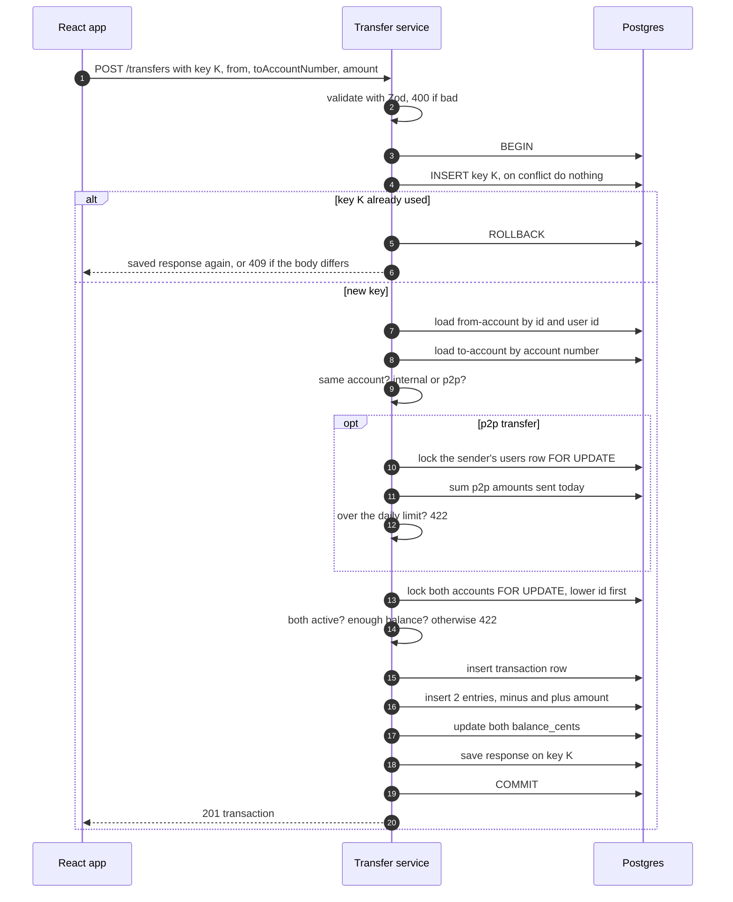
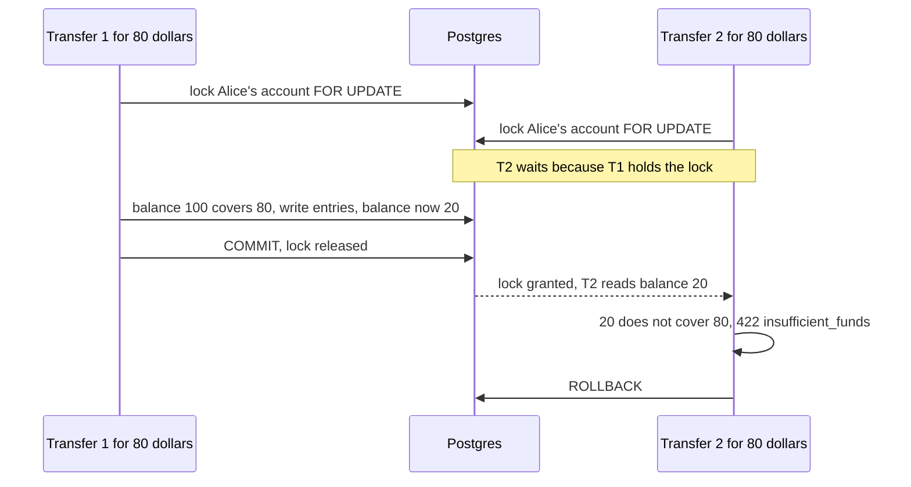

# 6. Money movement

## 6.1 The whole idea in one sentence

Every money movement is **one database transaction** that records a transaction row, writes entries that add up to zero, and updates the cached balances. Either all of it happens, or none of it does.

(Careful with the word "transaction": a **database transaction** is a `BEGIN ... COMMIT` block, the all-or-nothing unit. A **G-Bank transaction** is a row in the `transactions` table, a money event. Each G-Bank transaction is written inside one database transaction.)

## 6.2 Types of money movement

| Type | From | To | Limits | Started by |
|---|---|---|---|---|
| `welcome_bonus` | Funding account | New checking account | Once per user, $1,000.00 | The system, during signup |
| `deposit` | Funding account | One of your accounts | Up to $10,000.00 each | You |
| `internal_transfer` | One of your accounts | Another of your accounts | Up to $10,000.00 each, no daily limit | You |
| `p2p_transfer` | One of your accounts | Someone else's account | Up to $5,000.00 per UTC day in total | You |
| `reversal` (v2) | The original "to" account | The original "from" account | Admin only | Admin |

## 6.3 Money on the client

The browser needs to turn what the user types ("12.30") into cents (`1230`). **Don't do it with math:**

```js
0.29 * 100          // 28.999999999999996
Math.round(0.29 * 100) // 29, but only because we got lucky with rounding
```

Computers store decimals like `0.29` as close approximations, so multiplying drifts. Instead, `shared/src/money.ts` treats it as text:

- `parseDollarsToCents("12.3")`: check the text against `^\d{1,5}(\.\d{1,2})?$`, split on the dot, pad the cents to 2 digits: `12` and `30` gives `1230`. Anything else is invalid.
- `formatCents(1230)` gives `"$12.30"`, using `Intl.NumberFormat("en-US", { style: "currency", currency: "USD" })`. Dividing by 100 is fine here because the result is only displayed, never saved.

Both are shared by the web app and the server, and both get unit tests.

## 6.4 The transfer algorithm

Inside `createTransfer`, in order:

1. **Validate** the body with Zod. Bad input gets `400` before touching the database.
2. **Hash the request** (method + path + body) for the idempotency check.
3. `BEGIN`
4. **Claim the idempotency key:** `INSERT INTO idempotency_keys ... ON CONFLICT DO NOTHING`.
   - Inserted: this is a new request, keep going.
   - Conflict: the key was used before. Read the saved row. Different hash means `409 idempotency_key_reused`. Same hash means return the saved response. Stop here.
   - If another request with the same key is still running, Postgres makes this insert **wait** until that one finishes. That's how the "still processing" case in the [API doc](04-api.md#43-idempotency) works without any extra code.
5. **Load the from-account** by ID **and** user ID. Missing means `404 not_found`.
6. **Load the to-account** by account number. Missing or a system account means `404 recipient_not_found`.
7. Same account means `422 same_account`.
8. **Decide the type:** `internal_transfer` if you own the to-account, `p2p_transfer` otherwise.
9. **If p2p:** lock the user's own `users` row (`SELECT ... FOR UPDATE`), add up what they've sent to others today, and if that plus this amount is over $5,000.00, `422 daily_limit_exceeded`.
10. **Lock both account rows** with `SELECT ... FOR UPDATE`, **lower ID first**.
11. Both accounts must be `active`, otherwise `422 account_not_active`. The from-account balance must cover the amount, otherwise `422 insufficient_funds`.
12. **Insert** the `transactions` row.
13. **Insert two entries:** `-amount` on the from-account and `+amount` on the to-account, each with its new `balance_after_cents`.
14. **Update** both accounts' `balance_cents`.
15. **Save the response** on the idempotency key row.
16. `COMMIT`, then respond `201`.

If anything throws at any step, we `ROLLBACK` and nothing is saved, not even the idempotency key. That's why a failed request can be retried with the same key.



**What `FOR UPDATE` does:** it puts a lock on the rows it reads. Any other database transaction that tries to lock the same rows has to **wait** until we `COMMIT` or `ROLLBACK`. It turns "two people grabbing the same money at once" into "two people in a line."

## 6.5 What happens when things happen at the same time

This is where banking gets hard, and why this project is worth doing.

### Scenario A: double-click
Handled by the idempotency key. See the [API doc](04-api.md#43-idempotency).

### Scenario B: two transfers try to spend the same money

Alice has $100.00. She has two browser tabs open and sends $80.00 from each, at the same moment.



**Without the lock**, both would read $100, both would decide there's enough, and both would write. The balance would end up at -$60, or the `CHECK` constraint would stop the second one with an ugly `500` error. The lock turns a race into a queue, and the constraint is the backup in case the lock is ever missing.

### Scenario C: deadlock

Alice sends to Bob at the same moment Bob sends to Alice.
- Transfer 1 locks Alice's account, then wants Bob's.
- Transfer 2 locks Bob's account, then wants Alice's.
- Each is waiting for the other, forever. That's a **deadlock**. Postgres notices after about a second and kills one of them with an error.

**Fix:** always lock accounts in the same order (lower ID first). Then both transfers try to lock the same account first, one waits, and there's no circle.

### Scenario D: sneaking past the daily limit

Bob has sent $4,000 today. He fires off two $900 transfers at the same moment. Both read "sent today: $4,000", both see $4,900 as under the limit, and both go through: $5,800 sent.

**Fix:** step 9 locks Bob's `users` row before reading the total. The second transfer waits, then sees $4,900 and gets `422 daily_limit_exceeded`.

### Scenario E: two signups with the same email
The unique constraint on `users.email` lets only one win. The other gets `409 email_taken`.

## 6.6 Isolation level

Postgres runs every database transaction at an **isolation level**, which decides how much concurrent transactions can see of each other. We use the default, **READ COMMITTED**, plus the explicit row locks above.

The alternative is **SERIALIZABLE**, where Postgres detects conflicts for you but cancels one of the transactions, and your code has to retry it. Explicit locks are easier to reason about while you're learning, because you can see exactly what waits for what.

**Keep database transactions short.** Never do slow work inside one: no password hashing, no calls to Turnstile, no network requests. Other requests may be waiting on your locks.

## 6.7 Deposits

Same pattern, simpler:
1. Validate. Hash the request. `BEGIN`. Claim the idempotency key.
2. Load the account by ID **and** user ID (`404` if missing). It must be `active`.
3. Lock the funding account and the customer account, lower ID first.
4. Insert the transaction (`deposit`) and two entries: `-amount` on funding and `+amount` on the customer account.
5. Update both balances. Save the response. `COMMIT`. `201`.

## 6.8 Welcome bonus

Part of the signup database transaction ([Auth doc](05-auth-security.md#53-sign-up)). Same steps as a deposit, with type `welcome_bonus`, `initiated_by = null`, and no idempotency key, since the signup can only succeed once per email anyway.

## 6.9 Planned service functions

```ts
type TransferInput = {
  userId: string;
  fromAccountId: string;
  toAccountNumber: string;
  amountCents: number;
  note?: string;
  idempotencyKey: string;
  requestHash: string;
};

type DepositInput = {
  userId: string;
  accountId: string;
  amountCents: number;
  idempotencyKey: string;
  requestHash: string;
};

// Both return the Transaction object from the API doc,
// or throw an AppError subclass (InsufficientFundsError, etc).
function createTransfer(input: TransferInput): Promise<IdempotentResult<Transaction>>;
function createDeposit(input: DepositInput): Promise<IdempotentResult<Transaction>>;
function getLimits(userId: string): Promise<Limits>;

// replayed tells the handler whether to add the Idempotent-Replayed header.
type IdempotentResult<T> = { status: number; body: T; replayed: boolean };
```

## Check yourself

1. In Scenario B, what would happen if we removed `FOR UPDATE` but kept the `CHECK` constraint? What would Alice see in the second tab?
2. Why do we always lock the lower account ID first?
3. Why do we hash the password *before* `BEGIN` in signup, instead of inside the database transaction?
