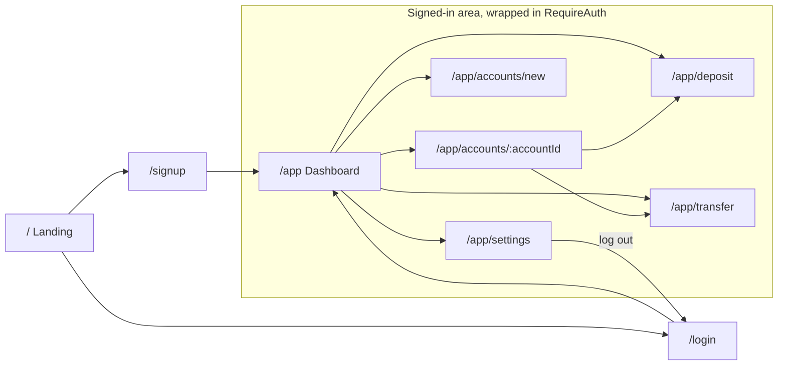
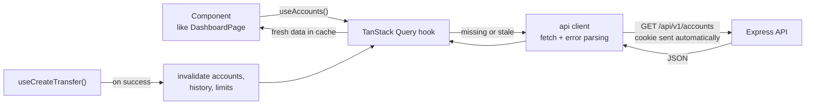
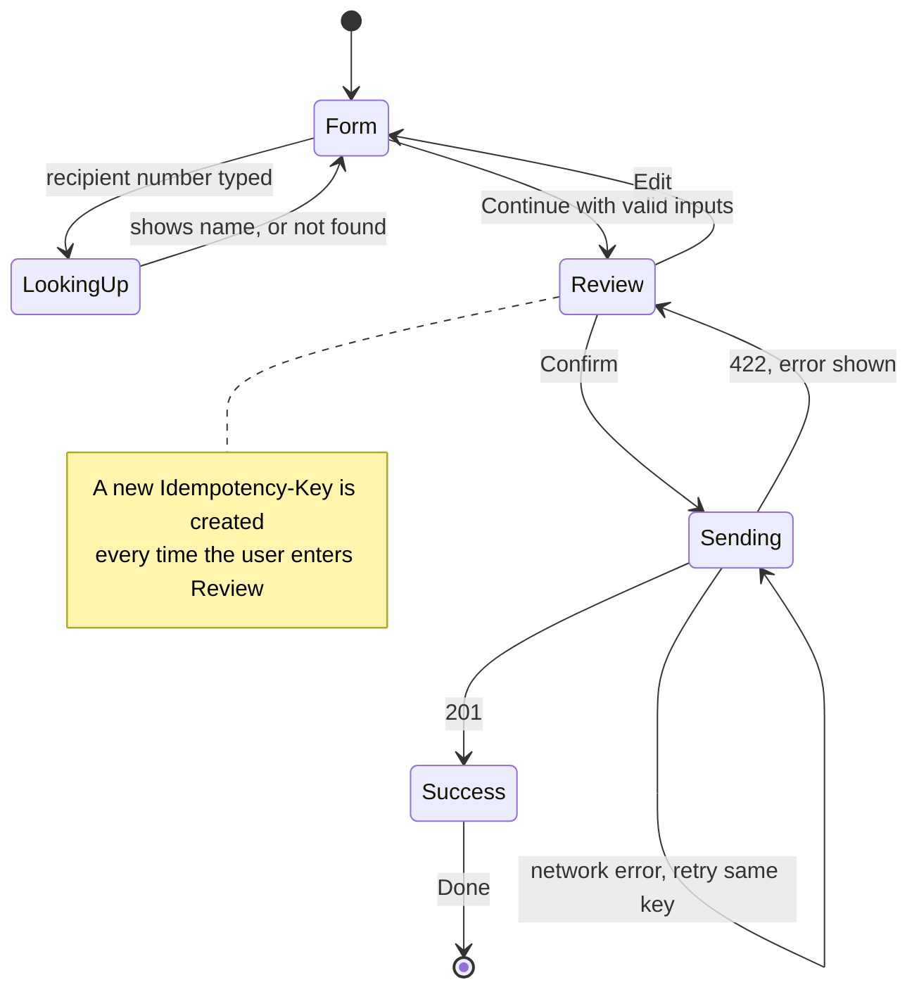

# 7. Frontend

## 7.1 Pages and routes

| Path | Page | Needs login? | Notes |
|---|---|---|---|
| `/` | Landing | no | "G-Bank: next generation banking", sign up and log in buttons, demo notice |
| `/signup` | Sign up | no | Already logged in? Go to `/app` |
| `/login` | Log in | no | `?next=` returns you where you were. `?reason=expired` shows "You were signed out for inactivity" |
| `/app` | Dashboard | yes | Accounts, total, recent activity, quick actions |
| `/app/accounts/new` | Open account | yes | |
| `/app/accounts/:accountId` | Account detail | yes | Balance, show/hide number, rename, history with "Load more" |
| `/app/deposit` | Deposit | yes | `?to=accountId` preselects the account |
| `/app/transfer` | Send money | yes | Form, review, result (section 7.4) |
| `/app/settings` | Settings | yes | Change password, sign out other devices |
| `*` | Not found | no | |



## 7.2 Component tree

```
<App>
└─ <QueryClientProvider>            TanStack Query cache for the whole app
   └─ <RouterProvider>
      ├─ <PublicLayout>             logo + demo banner
      │  ├─ LandingPage
      │  ├─ SignupPage
      │  └─ LoginPage
      └─ <RequireAuth>              no user? redirect to /login?next=...
         └─ <AppShell>              header, nav, user menu, DemoBanner,
            │                       IdleTimeoutWatcher, <Outlet/>
            ├─ DashboardPage
            │  ├─ TotalBalanceCard
            │  ├─ AccountCard (one per account)
            │  └─ RecentActivityList
            ├─ AccountDetailPage
            │  ├─ AccountHeader     balance, show/hide number, rename
            │  └─ HistoryList       + Load more
            ├─ OpenAccountPage
            ├─ DepositPage
            ├─ TransferPage
            │  ├─ TransferForm
            │  ├─ TransferReview
            │  └─ TransferResult
            └─ SettingsPage
```

## 7.3 Data: server state vs UI state

Two kinds of state live in a React app:
- **Server state:** data that really lives in the database (accounts, balances, history). The browser only holds a *copy*, which can go stale. **TanStack Query** manages these copies: fetching, caching, refetching, and loading and error states.
- **UI state:** things only this screen cares about (what's typed in a form, whether a dialog is open). Plain `useState`.

No Redux or other global store. Between TanStack Query and `useState`, there's nothing left for it to do.



**Query keys and when they refresh**

| Query key | Endpoint | Refetched after |
|---|---|---|
| `["me"]` | `GET /me` | Login, logout, password change |
| `["accounts"]` | `GET /accounts` | Open account, rename, deposit, transfer |
| `["account", id]` | `GET /accounts/:id` | Rename, deposit, transfer |
| `["history", id]` | `GET /accounts/:id/history` (infinite query) | Deposit, transfer |
| `["history", "recent"]` | `GET /history?limit=5` | Deposit, transfer |
| `["limits"]` | `GET /me/limits` | Transfer to someone else |

**The api client** (`web/src/api/client.ts`) is one small `fetch` wrapper that:
- adds the `/api/v1` prefix and JSON headers, and sends cookies (`credentials: "same-origin"`)
- turns any non-2xx response into an `ApiError` with `status`, `code`, `message`, `details`, and `requestId`
- on a `401` from any endpoint except `/me` and `/auth/*`: clears the cache and sends the user to `/login?reason=expired`

## 7.4 The transfer flow

Three steps on one page: **form**, **review**, **result**.



**The important detail:** the idempotency key is created when the user **arrives at Review**, not when they click Confirm. Every click of Confirm, and every automatic retry after a network error, reuses that key. If they go back to Edit and change something, returning to Review creates a new key, because it's a new intent.

**Dashboard sketch**

```
+----------------------------------------------------+
| G-Bank        Dashboard   Send money   Alice v     |
| Demo project. Not a real bank. Fake money only.    |
+----------------------------------------------------+
|  Total balance                                     |
|  $1,275.00                                         |
|                                                    |
|  +--------------+  +--------------+  +-----------+ |
|  | Checking     |  | Savings      |  |  + Open   | |
|  | ....1746     |  | ....2290     |  |  account  | |
|  | $975.00      |  | $300.00      |  |           | |
|  +--------------+  +--------------+  +-----------+ |
|                                                    |
|  [ Send money ]   [ Deposit ]                      |
|                                                    |
|  Recent activity                                   |
|  Sep 10   To Bob S. ....7731              -$25.00  |
|  Sep 10   Deposit to Savings             +$300.00  |
|  Sep 9    Welcome bonus                +$1,000.00  |
+----------------------------------------------------+
```

**Review step sketch**

```
+----------------------------------------------------+
|  Review transfer                                   |
|                                                    |
|  From      Checking ....1746                       |
|  To        Bob S. ....7731                         |
|  Amount    $25.00                                  |
|  Note      pizza                                   |
|                                                    |
|  Left to send today after this: $4,975.00          |
|                                                    |
|  [ Edit ]                     [ Confirm and send ] |
+----------------------------------------------------+
```

## 7.5 Forms

- Plain controlled inputs (`value` + `onChange` with `useState`). No form library at first, so you see how forms work in React.
- On submit, run the **same Zod schema the server uses** (from `shared/`). Show field errors immediately, without a server round trip.
- If the server still returns `400 validation_error`, show its `details` next to the matching fields.
- Money inputs: `type="text"` with `inputMode="decimal"` (brings up the number keypad on phones), parsed with `parseDollarsToCents`.
- Disable the submit button while a request is in flight.

## 7.6 Four states for every screen that loads data

| State | What the user sees |
|---|---|
| Loading | Grey placeholder shapes (skeletons), not a blank page |
| Empty | A friendly message: "No transactions yet. Make a deposit to get started." |
| Error | What went wrong, a Retry button, and the request ID in small print |
| Success | The data |

## 7.7 Idle timeout on the client

The **server** enforces the 15-minute idle timeout. The client only warns:
- `IdleTimeoutWatcher` tracks the last mouse, keyboard, or touch activity.
- At 13 minutes idle it opens a dialog: "Still there? You'll be signed out in 2:00" with a **Stay signed in** button.
- **Stay signed in** calls `GET /me`, which counts as activity and refreshes `last_seen_at` on the server.
- At 15 minutes it sends the user to `/login?reason=expired`.

## 7.8 Styling, design, and accessibility

- **Tailwind CSS v4** for styling, **shadcn/ui** for ready-made accessible components: Button, Input, Label, Card, Select, Dialog, Skeleton, Sonner (toast notifications), DropdownMenu.
- **Brand:** G-Bank, "next generation banking." We do a short design pass in Milestone 4: colors, fonts, and a simple wordmark logo.
- **Phone first:** everything works on a 360px-wide screen. Tables become stacked lists on small screens.
- **Accessibility:**
  - every input has a visible label
  - errors are linked to their input (`aria-describedby`) and announced
  - visible focus outlines, everything reachable by keyboard
  - color is never the only signal (amounts show `+` and `-`, not just green and grey)
  - text contrast meets WCAG AA

## 7.9 React refresher (Milestone 4)

Before building G-Bank screens, a handful of tiny standalone exercises:

| Concept | Mini exercise |
|---|---|
| Components and JSX | A `BalanceCard` that shows a hard-coded balance |
| Props | Pass the balance and account name in from the parent |
| State and events | A counter, then a show/hide account number toggle |
| Lists and keys | Render a list of fake transactions |
| Forms | A controlled amount input that shows the parsed cents live |
| Effects | Fetch something with `useEffect`, then see why TanStack Query replaces it |
| Routing | Two pages and a link between them |

## Check yourself

1. Why is the idempotency key created when the user enters Review instead of when they click Confirm?
2. After a successful transfer, which query keys must refresh? What would the user see if we forgot `["accounts"]`?
3. The client warns at 13 minutes. Who actually enforces the 15-minute timeout, and why can't we trust the client to do it?
