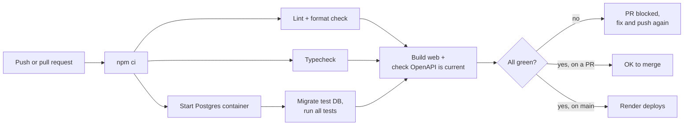
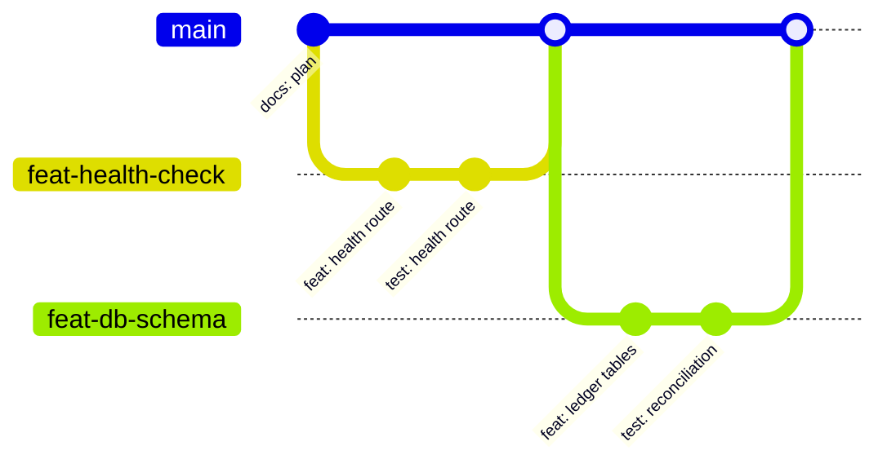

# 8. Testing and quality

## 8.1 Strategy

| Level | Tools | What it covers | How much |
|---|---|---|---|
| Unit | Vitest | Pure functions: money parsing and formatting, account number generation, cursor encoding, password rules | Some |
| API integration | Vitest + Supertest + a real Postgres test database | Every endpoint: happy path, validation, auth, business rules, concurrency | **Most** |
| Component | Vitest + React Testing Library | The tricky UI: money input, the transfer flow | Some |
| End-to-end | Playwright | Sign up, deposit, transfer, log out in a real browser | Stretch goal |
| Load | k6 | Many simulated users at once (transfers, history, login), with pass/fail thresholds on p95 latency and error rate. Run on your laptop, then reconcile the ledger | End of M3 and M6 |

**Why test against a real database instead of a fake one?** The bugs that matter most here (locks, constraints, all-or-nothing transactions) live inside Postgres. A fake database would happily pass tests that the real one fails in production.

## 8.2 Test setup

- **Database:** `gbank_test`. Migrations run once before the test suite starts.
- **Before each test:** `TRUNCATE` every table, then re-seed the funding account. Each test starts from a clean bank.
- **After each test:** run the three reconciliation checks from the [Database doc](03-database.md#34-guardrails-inside-the-database). If any rule broke, the test fails. That turns every single test into a ledger test for free.
- **Fake clock:** tests call `clock.set(...)` to jump 16 minutes ahead (idle timeout) or to tomorrow (daily limit reset), instead of actually waiting.
- **Helpers:**
  - `signUpAndLogIn(name)` returns a Supertest agent that keeps the session cookie
  - `deposit(agent, accountId, cents)` puts money somewhere quickly
- Test files run one at a time (`fileParallelism: false`), because they share one database.

## 8.3 Tests that must exist

**Money**
- [ ] Deposit raises the balance and writes 2 entries that add up to 0
- [ ] Transfer between own accounts moves the exact amount
- [ ] Transfer to another customer; the recipient's history shows "From Alice M. ••••1746"
- [ ] Not enough money gives `422`, both balances unchanged, no entries written
- [ ] Same from and to account gives `422 same_account`
- [ ] A frozen account can't send or receive
- [ ] Daily limit: $4,000 then $1,000 both succeed, the next $0.01 fails; the next UTC day works again
- [ ] Transfers between your own accounts don't count toward the daily limit
- [ ] Same idempotency key twice: one transaction, identical responses, the second has `Idempotent-Replayed: true`
- [ ] Same idempotency key with a different body gives `409`
- [ ] **Concurrency:** 10 simultaneous $200 transfers from a $1,000 balance: exactly 5 succeed, balance ends at $0
- [ ] **Concurrency:** A-to-B and B-to-A, 20 of each at once: no deadlock errors, total money unchanged
- [ ] **Concurrency:** simultaneous transfers to others can't beat the daily limit
- [ ] Updating or deleting a ledger row raises an error (the trigger works)
- [ ] Amounts of 0, negative, decimal, over $10,000, or a string give `400`

**Auth**
- [ ] Signup creates the user, a checking account, and the $1,000 bonus, and logs in
- [ ] Duplicate email gives `409`
- [ ] Wrong password gives `401` with the same message as an unknown email
- [ ] 5 failures lock the account (`429`); after 15 minutes login works again
- [ ] 16 minutes idle gives `401 session_expired`; 12 hours total does too
- [ ] After logout, the old cookie is rejected
- [ ] After a password change, other sessions are rejected and the current one still works
- [ ] A missing or foreign `Origin` on a POST gives `403`
- [ ] Every endpoint that takes an `accountId` returns `404` for another user's account
- [ ] Unknown fields in a body give `400`

**Web**
- [ ] `parseDollarsToCents`: `"0.29"` is 29, `"10"` is 1000, `"1.5"` is 150; `"1.234"`, `"-1"`, `""`, and `"abc"` are invalid
- [ ] Transfer flow: retries reuse the key; going back to Edit creates a new one

## 8.4 Code quality tools

- **TypeScript strict mode** everywhere. `npm run typecheck` checks all three workspaces.
- **ESLint** (flat config + typescript-eslint) catches likely bugs.
- **Prettier** formats code automatically, so reviews are never about formatting.

**Scripts**

| Command | What it does |
|---|---|
| `npm run dev` | Server and web together, reload on save |
| `npm test` | All tests |
| `npm run lint` / `npm run format` | ESLint / Prettier |
| `npm run typecheck` | `tsc --noEmit` on every workspace |
| `npm run build` | Build the web app into `web/dist` |
| `npm run db:generate` | Create a migration from `schema.ts` changes |
| `npm run db:migrate` | Apply migrations |
| `npm run db:seed` | Seed data |
| `npm run db:reconcile` | Run the ledger checks against the current database |

## 8.5 CI pipeline (GitHub Actions)

Runs on every push and every pull request.

"Check OpenAPI is current" regenerates `openapi.json` from the Zod schemas and fails if it differs from the committed file. The docs can't silently drift from the code.

**The CD half:** on `main` only, a second job called `deploy` runs after `check` passes and calls Render's deploy hook (see [Deployment](09-deployment.md#94-render-setup)). Pull requests run `check` but never `deploy`.

## 8.6 Git workflow

- `main` is always deployable. It's protected: changes only arrive through pull requests, and CI must pass.
- One branch per task: `feat/transfers-api`, `fix/lockout-timer`, `docs/api-errors`, `chore/eslint`.
- Small pull requests (aim for under 300 changed lines). Easier to review, easier to undo.
- Commit messages follow **Conventional Commits**: `feat: add transfer endpoint`, `fix: lock accounts in id order`.
- Every PR description has: what changed and why, how it was tested, screenshots for UI changes, and a checklist (tests added, docs updated, no secrets).
- Read your own diff before merging. I can review PRs with you too.

## 8.7 Observability: knowing what the app is doing

- **Structured logs with pino:** one JSON line per request, with `requestId`, `userId` (if logged in), method, path, status, and duration. Easy to search.
- **Redacted:** password fields, `cookie` and `set-cookie` headers. Account numbers show only the last 4 digits.
- **Health checks:** `/api/v1/health` (process is up) and `/api/v1/health/ready` (database reachable). Render uses the first one to know a deploy worked.
- **Where to look:** Render's log viewer. Later, Sentry's free tier for error alerts.

## 8.8 Definition of done (for every feature)

- [ ] Contract updated: Zod schema, and the [API doc](04-api.md) if behavior changed
- [ ] Tests for the happy path and every error code the feature can return
- [ ] Lint, typecheck, and tests green in CI
- [ ] UI has loading, empty, and error states
- [ ] **You can explain how it works without looking at the code**
- [ ] Merged through a pull request with a clear description

## Check yourself

1. Why do our tests use a real Postgres instead of a fake database?
2. What does the "reconciliation after every test" hook catch that a normal `expect(...)` in the test might miss?
