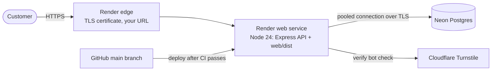
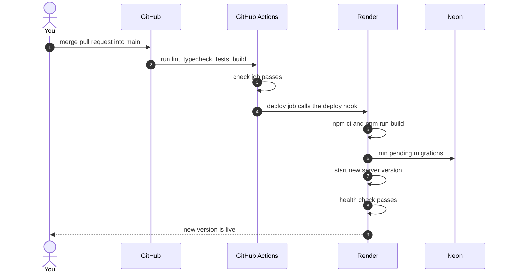

# 9. Deployment and environments

## 9.1 Production setup



**Deploy early (decision D17).** Milestone 0 deploys the app while it only has a health check. From then on every milestone ships to the live URL, so deployment problems show up one at a time instead of all at once at the end.

## 9.2 Local setup (one time)

1. Install **Postgres.app** (free) from postgresapp.com, click Initialize, and add its command-line tools to your PATH (the app shows how).
2. Create the two databases:
   ```bash
   createdb gbank_dev && createdb gbank_test
   ```
3. Copy the example env file and fill it in:
   ```bash
   cp .env.example .env
   ```
4. Install dependencies, set up the database, and start everything:
   ```bash
   npm install && npm run db:migrate && npm run db:seed && npm run dev
   ```
5. Open http://localhost:5173

## 9.3 Environment variables

| Name | Example in development | Used by | Notes |
|---|---|---|---|
| `NODE_ENV` | `development` | server | `production` on Render |
| `PORT` | `3000` | server | Render sets this itself |
| `DATABASE_URL` | `postgres://localhost:5432/gbank_dev` | server | Neon's **pooled** connection string in production |
| `MIGRATION_DATABASE_URL` | same as above | migrations | Neon's **direct** connection string in production (migrations should skip the pooler) |
| `TEST_DATABASE_URL` | `postgres://localhost:5432/gbank_test` | tests | |
| `APP_ORIGIN` | `http://localhost:5173` | server | Used by the Origin check. Production: your Render URL |
| `SESSION_COOKIE_NAME` | `gbank_session` | server | `__Host-gbank_session` in production |
| `TURNSTILE_SECRET_KEY` | Cloudflare's always-pass test secret | server | Real secret in production |
| `VITE_TURNSTILE_SITE_KEY` | Cloudflare's always-pass test site key | web, at build time | Public by design, safe in the browser |
| `LOG_LEVEL` | `debug` | server | `info` in production |

`config.ts` validates all of these with Zod when the server starts. Anything missing or malformed stops the server immediately with a message that names the variable.

## 9.4 Render setup

- **New Web Service** connected to the GitHub repo, runtime Node.
- **Region:** the same region as your Neon database (for example, both in US East), so every query doesn't cross the country.
- **Build command:** `npm ci --include=dev && npm run build`
  - We set `NODE_ENV=production` on Render, and with that set, `npm ci` skips dev dependencies. Vite and TypeScript are dev dependencies, so without `--include=dev` the build fails.
- **Start command:** `npm run db:migrate:prod && npm start`
  - Migrations run before the server starts. If one fails, the new version never goes live and the old one keeps running.
- **Health check path:** `/api/v1/health`
- **Auto-deploy:** Off. Deploys are started by the `deploy` job in `.github/workflows/ci.yml`, which runs on `main` only after the `check` job passes and calls Render's **deploy hook**: a secret URL stored as the GitHub secret `RENDER_DEPLOY_HOOK_URL`. The whole pipeline is readable in one file.
- **Environment variables:** set in the Render dashboard, never in the repo.

**Free tier facts to know:**
- The service **sleeps after about 15 minutes without traffic**. The first request after that takes up to a minute while it wakes. Fine for a portfolio project; mention it in the README so visitors aren't confused.
- **512 MB of memory.** That's why the argon2 settings are tuned (see [Auth doc](05-auth-security.md#56-passwords)).
- **In-memory rate limit counters reset when the service restarts or sleeps.** Acceptable for v1. With more than one server, we'd move them into Postgres or Redis.

## 9.5 Neon setup

- Create a project named `g-bank`. Use the same major Postgres version as your local Postgres.app, so behavior matches.
- Copy two connection strings: **pooled** (for the app) and **direct** (for migrations). Both include `sslmode=require`.
- Free tier facts: the database **scales to zero** when idle, so the first query after a quiet period is a bit slower; storage is limited but far more than G-Bank needs.
- Stretch: Neon **branches** let you copy the production database in seconds to test a risky migration safely.

## 9.6 What happens when you merge a pull request



**Migrations and the running app:** during a deploy, the old server version is still running for a moment while the new schema is already in place. So migrations must not break the old code. For example, add a new column first and start using it in a later deploy, instead of renaming a column in one step. This is called **expand and contract**, and it's how real teams change databases without downtime.

## 9.7 Production-only settings

- `app.set("trust proxy", 1)`: Render sits in front of Express, so without this every request looks like it came from Render's IP. Rate limits would lump all users together, and Express wouldn't know the connection was HTTPS.
- Cookie: `Secure` + `__Host-` prefix.
- helmet with HSTS (tells browsers to always use HTTPS for G-Bank).
- Express serves `web/dist`: long browser caching for the hashed asset files, no caching for `index.html`, and any non-`/api` GET falls back to `index.html` so React Router can handle the URL.
- Production seed only creates the funding account. No demo users.

## 9.8 Launch checklist

- [ ] Every item in the [security checklist](05-auth-security.md#510-security-checklist-before-launch) is ticked
- [ ] CI green on `main`
- [ ] All environment variables set in Render; no secrets in the repo
- [ ] Migrations applied and the funding account exists in production
- [ ] Sign up, deposit, send money, and log out all work on the live URL, on a phone and on a laptop
- [ ] Turnstile works with the real keys
- [ ] Demo banner visible on every page
- [ ] README has the live link, screenshots, an architecture diagram, and a "what I learned" section

## 9.9 Cost

**$0 per month:** Render free tier, Neon free tier, Cloudflare Turnstile, GitHub. Optional: a custom domain for about $10 a year.

## Check yourself

1. Why would the Render build fail with plain `npm ci`?
2. What goes wrong with rate limiting if we forget `trust proxy`?
