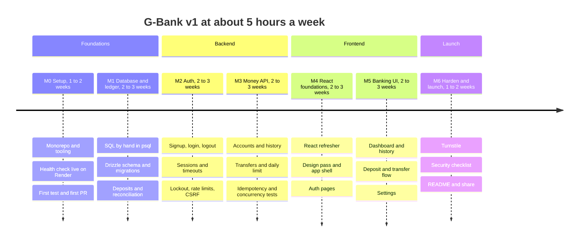
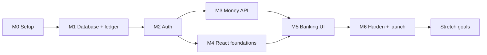

# 10. Roadmap

**Pace:** about 5 hours a week, no deadline. Estimates are ranges and include time to learn, not just to type. Total for v1: roughly **12 to 19 weeks** (3 to 5 months).

What depends on what:

M4 only needs auth (M2), so if backend work gets tiring you can switch to M4 and come back to M3.

**Who does what**, across every milestone:

| You write | Claude handles |
|---|---|
| Routes, services, queries, React components, and their tests | Tooling and config, CI, boilerplate, explanations, reviewing your code, debugging with you |

---

## M0. Setup and walking skeleton
**1 to 2 weeks.** Goal: an app that does almost nothing but is completely real: on GitHub, tested, CI green, live on the internet.

**You'll learn:** what a server is (requests, responses, ports), npm workspaces, environment variables, middleware, git branches and pull requests, CI.

**Step-by-step plan:** [plans/2026-09-10-m0-walking-skeleton.md](plans/2026-09-10-m0-walking-skeleton.md)

| # | Task | Who |
|---|---|---|
| 1 | Reshape the starter files into `server/` and `shared/` workspaces (`web/` arrives in M4) | Claude sets up, you review |
| 2 | ESLint, Prettier, typecheck scripts | Claude |
| 3 | `config.ts`: validate env vars with Zod | You, guided |
| 4 | Split `app.ts` and `index.ts`; health route; request ID; pino logger | You write the route, Claude explains middleware |
| 5 | `AppError` class + error handler with the standard error shape | You |
| 6 | First test: `GET /health` with Vitest + Supertest | You |
| 7 | Branch protection and first pull request (the repo itself was created on 2026-09-10) | You, guided |
| 8 | GitHub Actions CI | Claude writes it, you read it line by line |
| 9 | Deploy to Render (no database yet) | You click, Claude guides |

**Done when:** your Render URL returns `{"status":"ok"}`, CI is green, and the first PR is merged.

## M1. Database and ledger core
**2 to 3 weeks.** Goal: money can be stored and moved correctly in code, proven by tests. No HTTP or login yet.

**You'll learn:** tables, rows, primary and foreign keys, constraints, `SELECT` / `INSERT` / `UPDATE` / `JOIN` / `GROUP BY`, database transactions (`BEGIN` / `COMMIT` / `ROLLBACK`), migrations, what an ORM does.

| # | Task | Who |
|---|---|---|
| 1 | Install Postgres.app, create `gbank_dev` and `gbank_test` | You, guided |
| 2 | **SQL by hand lab** in `psql`: create a toy table, insert, query, join, try `BEGIN` then `ROLLBACK`, watch a `CHECK` constraint reject a bad row | You, Claude writes the exercises |
| 3 | Drizzle setup; `schema.ts` with `accounts`, `transactions`, `entries` | You write the tables, Claude reviews |
| 4 | First migration, then the append-only trigger migration | You, guided |
| 5 | Seed script: the funding account | You |
| 6 | Services: `openAccount`, `createDeposit` (no idempotency yet), reconciliation script | You |
| 7 | Test harness: truncate before each test, reconcile after each test | Claude builds it, you write the tests |
| 8 | Create the Neon project; run migrations on deploy | You, guided |

**Done when:** tests prove deposits write balanced entries, and `npm run db:reconcile` reports zero problems on both your laptop and Neon.

## M2. Auth
**2 to 3 weeks.** Goal: real accounts with real security.

**You'll learn:** hashing vs encryption, salts, cookies, sessions, authentication vs authorization, CSRF, rate limiting, timing attacks.

| # | Task | Who |
|---|---|---|
| 1 | `users` and `sessions` tables + migration | You |
| 2 | `lib/clock.ts` so tests can control time | Claude |
| 3 | Password module: argon2id hash and verify, password rules | You |
| 4 | Signup: user + checking account + welcome bonus + session in one database transaction | You |
| 5 | Session middleware (idle and absolute timeouts) + `requireAuth` | You, guided closely |
| 6 | Login with lockout; logout; `GET /me` | You |
| 7 | Change password + sign out other devices | You |
| 8 | helmet, Origin check, rate limits, `trust proxy` | Claude explains, you wire up |
| 9 | Every auth test from the [testing doc](08-testing-quality.md#83-tests-that-must-exist) | You |

**Done when:** all auth tests pass, and you can draw the login sequence diagram from memory.

## M3. Money API
**2 to 3 weeks.** Goal: the full banking API from the contract, safe under concurrency.

**You'll learn:** REST design, validation, row locks, isolation levels, deadlocks, idempotency, cursor pagination, OpenAPI.

| # | Task | Who |
|---|---|---|
| 1 | Zod schemas in `shared/` for accounts, history, recipients, deposits, transfers | You |
| 2 | Accounts endpoints with the `getOwnedAccount` helper | You |
| 3 | History endpoints with cursor pagination | You, guided |
| 4 | Recipient lookup | You |
| 5 | `idempotency_keys` table; deposits endpoint using it | You, guided closely |
| 6 | Transfers: internal and p2p, daily limit, locks in ID order | You, guided closely |
| 7 | `GET /me/limits` | You |
| 8 | OpenAPI generation + `/api/docs` + the CI "is it current" check | Claude |
| 9 | Concurrency tests | You write them, Claude helps with `Promise.all` patterns |

**Done when:** every money test passes, including the concurrency ones, and `/api/docs` shows every endpoint.

## M4. React foundations
**2 to 3 weeks.** Goal: the frontend skeleton, and your React knowledge back.

**You'll learn:** components, JSX, props, state, events, lists and keys, effects, routing, server state vs UI state, TanStack Query.

| # | Task | Who |
|---|---|---|
| 1 | React refresher exercises ([Frontend doc](07-frontend.md#79-react-refresher-milestone-4)) | You |
| 2 | Vite + Tailwind + shadcn/ui setup, dev proxy | Claude |
| 3 | Design pass: G-Bank colors, fonts, wordmark | Together |
| 4 | Router, layouts, `RequireAuth` | You |
| 5 | api client + `ApiError` + auth query hooks | You, guided |
| 6 | Sign up and log in pages, logout | You |
| 7 | `DemoBanner` and `IdleTimeoutWatcher` | You |

**Done when:** you can sign up and log in through the UI, protected pages redirect to login, and the idle warning appears.

## M5. Banking UI
**2 to 3 weeks.** Goal: every v1 feature usable in the browser.

| # | Task | Who |
|---|---|---|
| 1 | Dashboard | You |
| 2 | Account detail with "Load more" history | You |
| 3 | Open account, rename | You |
| 4 | Deposit form | You |
| 5 | Transfer flow: form, recipient lookup, review, result, idempotency key handling | You, guided closely |
| 6 | Settings page | You |
| 7 | Loading, empty, and error states everywhere | You |
| 8 | Phone layout and accessibility pass | Together |
| 9 | Component tests: money input, transfer flow | You |

**Done when:** the full journey works on a phone-sized screen: sign up, deposit, open savings, move money, pay someone, check history, change password.

## M6. Harden and launch
**1 to 2 weeks.** Goal: safe to share publicly.

| # | Task | Who |
|---|---|---|
| 1 | Turnstile on signup and login (client widget + server check) | You |
| 2 | Go through the security checklist | Together |
| 3 | Check the history query uses its index (`EXPLAIN ANALYZE`) | You, guided |
| 4 | README: live link, screenshots, architecture diagram, what you learned | You |
| 5 | Share it | You |

**Done when:** every box in the [launch checklist](09-deployment.md#98-launch-checklist) is ticked.

## After v1

Pick from the [stretch backlog](01-product.md#16-stretch-backlog-after-v1). The first two (demo login, two-factor login) make the biggest difference for a portfolio.

---

## How each session goes (about 1 to 2 hours)

1. **Recap:** one question about last session.
2. **Concept:** a short explanation of the new idea.
3. **Build in small pieces:** I explain a piece, you write it, I review it, with quick questions along the way.
4. **Commit and push:** small pull requests.
5. **Wrap-up:** 2 or 3 things you learned, and one small thing to try on your own.

Optional: keep `docs/learning-log.md` with one line per session (what you learned, what's still fuzzy). It becomes great material for the README and for interviews.

## Check yourself

1. Why deploy in M0, when there's nothing to show yet?
2. Why does M1 build deposits in code before there's any HTTP endpoint or login?
